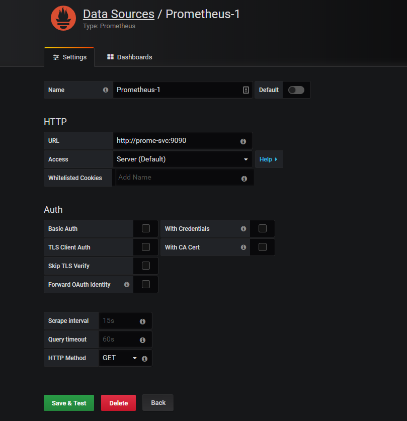
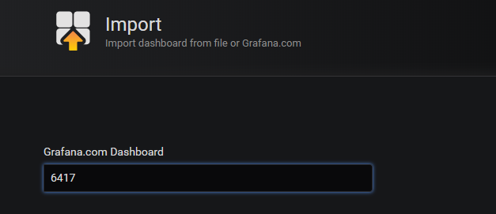
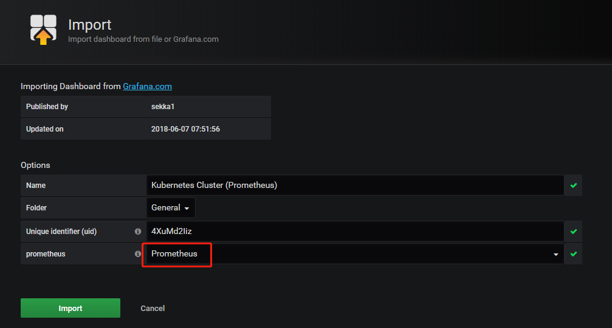
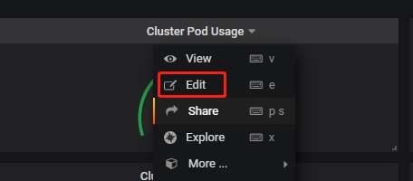

##### 创建 PVC

```yaml
apiVersion: v1
kind: PersistentVolumeClaim
metadata: 
  name: grafana-pvc
  namespace: kube-prometheus
  annotations: 
    volume.beta.kubernetes.io/storage-class: "managed-nfs-storage"
spec:
  accessModes: 
    - ReadWriteMany
  resources:
    requests: 
      storage: 200M
```

##### 创建 Grafana Deploy

```yaml
apiVersion: extensions/v1beta1
kind: Deployment
metadata:
  labels:
    app: grafana
  name: grafana
  namespace: kube-prometheus
spec:
  progressDeadlineSeconds: 600
  replicas: 1
  revisionHistoryLimit: 10
  selector:
    matchLabels:
      app: grafana
  strategy:
    rollingUpdate:
      maxSurge: 25%
      maxUnavailable: 25%
    type: RollingUpdate
  template:
    metadata:
      labels:
        app: grafana
    spec:
      containers:
      - env:
        # WEB 页面用户名
        - name: GF_SECURITY_ADMIN_USER
          value: admin
        # WEB 页面用户密码
        - name: GF_SECURITY_ADMIN_PASSWORD
          value: admin987
        image: grafana/grafana
        imagePullPolicy: IfNotPresent
        livenessProbe:
          failureThreshold: 3
          httpGet:
            path: /api/health
            port: grafana-port
            scheme: HTTP
          periodSeconds: 10
          successThreshold: 1
          timeoutSeconds: 1
        name: grafana
        ports:
        - containerPort: 3000
          name: grafana-port
          protocol: TCP
        readinessProbe:
          failureThreshold: 10
          httpGet:
            path: /api/health
            port: grafana-port
            scheme: HTTP
          initialDelaySeconds: 60
          periodSeconds: 10
          successThreshold: 1
          timeoutSeconds: 30
        resources:
          limits:
            cpu: 50m
            memory: 256Mi
          requests:
            cpu: 15m
            memory: 100M
        volumeMounts:
        - mountPath: /vat/lib/grafana
          name: grafana-storage
          subPath: grafana
      volumes:
      - name: grafana-storage
        persistentVolumeClaim:
          claimName: grafana-pvc
```

##### 创建 SVC

```yaml
apiVersion: v1
kind: Service
metadata:
  name: grafana
  namespace: kube-prometheus
spec:
  selector:
    app: grafana
  type: NodePort
  ports:
  - port: 3000
    targetPort: grafana-port
```

##### 应用 YAML

```bash 
kubectl apply -f ./
```

浏览器访问 http://NodeIP:Port 访问。

---

##### 添加数据源



URL：因为 Grafana 和 Prometheus 在同一个 Namespace 中，所以只需填写 Prometheus 的 Service 的 Name 即可。

> 访问模式是用来控制如何处理对数据源的请求的：
>
> - 服务器（Server）访问模式（默认）：所有请求都将从浏览器发送到 Grafana 后端的服务器，后者又将请求转发到数据源，通过这种方式可以避免一些跨域问题，其实就是在 Grafana 后端做了一次转发，需要从 Grafana 后端服务器访问该 URL。
> - 浏览器（Browser）访问模式：所有请求都将从浏览器直接发送到数据源，但是有可能会有一些跨域的限制，使用此访问模式，需要从浏览器直接访问该 URL。

##### 添加 Dashboard

从 [官方 dashboard](https://grafana.com/grafana/dashboards) 寻找合适的 dashboard，记下 Dashboard ID 号。在自建的 Grafana 后台中选择 Import ，输入 ID 号即可。





注意数据源的选择。



如果显示 N/A，则自己按照需求编辑查询语句。

---

##### 报警

> grafana 支持很多种形式的报警功能，比如 email、钉钉、slack、webhook 等。

- 在后台 Alerting 菜单添加。
- 通过 ConfigMap 挂载到 `/etc/grafana` 中。
- 现在版本（6.3.3）还只支持 Graph 图表的报警。