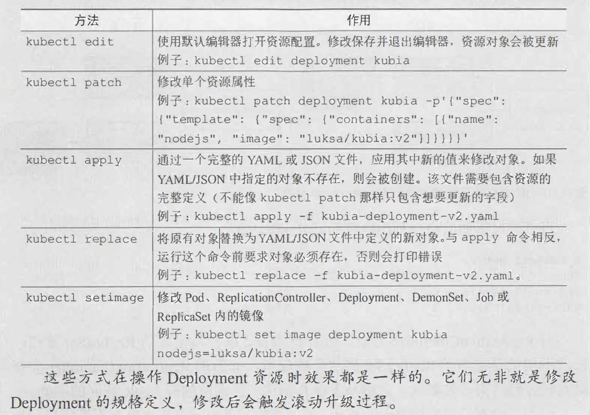
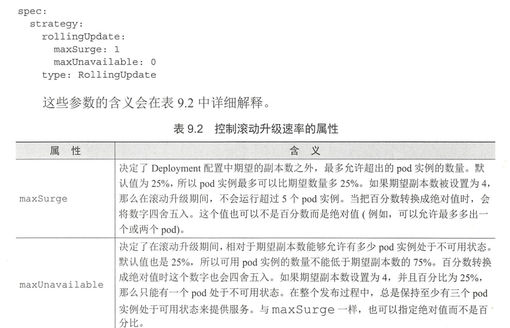

1. 微服务化：将一个大规模系统拆分成各个独立运行的组件

2. 更新 pod：

   - 直接删除所有现有的 pod, 然后创建新的 pod。
   - 先创建新的 pod, 并等待它们成功运行之后， 再删除旧的 pod。
   - 按顺序创建新的 pod, 然后逐渐删除旧的 pod。

3. 第 1 种会导致应用程序在一定的时间内不可用。2、3 种需要支持两个版本同时对外提供服务。如果你的应用程序使用数据库存储数据， 那么新版本不应该对原有的数据格式或者数据本身进行修改， 从而导致之前的版本运行异常。

4. kubectl set selector 命令来修改 Service 的 pod 选择器

5. 滚动更新

   ```bash
   kubectl rollout <old-pod-name> <new-pod-name> --image=<image-version>
   # 伸缩的请求是由 kubectl 客户端执行的，而不是由 Kubemetes master 执行的。
   ```

6. 在使用 Deployment 时， 实际的 pod 是由 Replicaset 创建和管理的， 而不是由 Deployment 直接创建和管理

7. 创建 Deployment

   ```bash
   kubectl .... --record
   # 记录历史版本号
   ```

8. 查看 Deployment 信息

   ```bash
   kubectl describe deploy <deploy-name>
   kubectl rollout status deploy <deploy-name>
   ```

9. 默认策略是执行滚动更新（策略名为 RollingUpdate )。另一种策略为 Recreate,它会一次性删除所有旧版本的pod, 然后创建新的 pod, 整个行为类似于修改 Replication Controller 的 pod 模板， 然后删除所有的 pod。

10. kubectl patch 修改单个或者少量资源属性

    ```bash
    kubectl patch deployment kubia -p '{"spec": {"minReadySeconds": 10}}'
    ```

11. 触发 Deployment 滚动更新

    ```bash
    kubectl set image deploy <deployment-name> <image-name>=<image:version>
    kubectl set image deployment kubia nodejs=luksa/kubia:v2
    ```

12. 

13. 如果 Deployment 中的 pod 模板引用了一个 ConfigMap (或 Secret ), 那么更改 ConfigMap 资原本身将不会触发升级操作。如果真的需要修改应用程序的配置并想触发更新的话， 可以通过创建一个新的 ConfigMap 并修改pod 模板引用新的 ConfigMap。

14. 回滚升级

    ```bash
    kubectl rollout undo deploy <deploy-name>
    ```

15. 显示升级历史

    ```bash
    kubectl rollout history deploy <deploy-name> [--to-revision=<history-num>]
    ```

16. 

17. 暂停和恢复滚动更新

    ```bash
    kubectl rollout pasue deploy <deploy-name>
    kubectl rollout resume deploy <deploy-name>
    ```

18. 如果部署被暂停， 那么在恢复部署之前， 撤销命令不会撤销它

19. minReadySeconds 属性指定新创建的 pod 至少要成功运行多久之后， 才能将其视为可用。

20. 如果只定义就绪探针没有正确设置 minReadySeconds , 一旦有一次就绪探针调用成功， 便会认为新的 pod 已经处于可用状态。因此最好适当地设置 minReadySeconds 的值。

21. 滚动升级失败的超时时间， 通过 的progressDeadlineSeconds 来指定

22. 小结

    - 使用 ReplicationController 管理 pod 并执行滚动升级
    - 创建 Deployment, 而不是底层的 ReplicationController 和 ReplicaSet
    - 通过更新 Deployment 定义的 pod 模板来更新 pod
    - 回滚 Deployment 到上个版本或历史版本列表中的任意一个历史版本
    - 中止 Deployment 滚动升级
    - 通过 maxSurge 和 maxUnavailable 属性控制滚动升级的速率
    - 使用 minReadySeconds 和就绪探针自动避免错误版本的升级
    - 在一个单一的 YAML 文件内使用三个横杠(---)作为分隔符定义多个资源