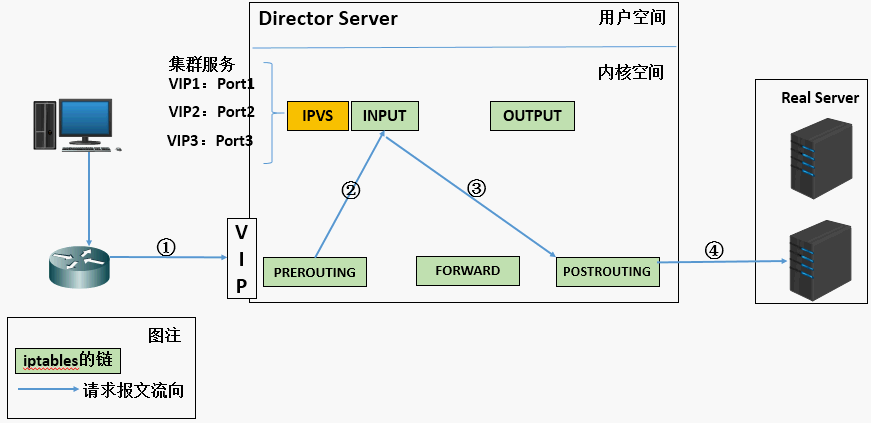

# LVS介绍^1^ ^2^ ^3^

负载均衡集群的前端使用一个调度器，将客户端请求**根据调度算法，转发到后端的服务器中**，同时调度器可能还具有后端服务器状态检测的功能，将故障的服务器自动下线，使得集群具有一定的容错能力。

LVS 是 Linux Virtual Server 的简称，也就是 Linux 虚拟服务器。这是一个由章文嵩博士发起的一个开源项目，它的官方网站是 [http://www.linuxvirtualserver.org](http://www.linuxvirtualserver.org/) 。现在 LVS 已经是 Linux 内核标准的一部分。通过 LVS 和 Linux 操作系统实现一个高性能高可用的 Linux 服务器集群，它具有良好的可靠性、可扩展性和可操作性。从而以低廉的成本实现最优的性能。LVS 是一个实现负载均衡集群的开源软件项目，从逻辑上可分为**调度层**、**Server 集群层**和**共享存储**。

1. **负载调度器（Load Blancer）**：LVS 集群对外的前端机器，负责接受 Client 的请求，并分发到服务器池执行。
2. **服务器池（server pool）**：一组真正执行 Client 请求的服务器，可以是 Web，FTP、Mail、DNS 等服务器组。
3. **共享存储（shared storage）**：为服务器池提供一个共享的存储区，使服务器池拥有相同的内容，提供相同的服务。

[TOC]

## 基本工作原理^2^

1. 当用户向负载均衡调度器（Director Server）发起请求，调度器将请求发往内核空间。
2. PREROUTING 链首先会接收到用户请求，判断目标 IP 确定是本机 IP，将数据包发往 INPUT 链。
3. IPVS 是工作在 INPUT 链上的，当用户请求到达 INPUT 时，IPVS 会将用户请求和自己已定义好的集群服务进行比对，如果用户请求的就是定义的集群服务，那么此时 IPVS 会强行修改数据包里的目标 IP 地址及端口，并将新的数据包发往 POSTROUTING 链

4. POSTROUTING 链接收数据包后发现目标 IP 地址刚好是自己的后端服务器，那么此时通过选路，将数据包最终发送给后端的服务器

## LVS组成^2^ ^3^

1. IPVS（IP virtual server）：工作在内核空间，是真正生效实现调度的代码。
2. ipvsadm：工作在用户空间，负责为 IPVS 内核框架编写定义和管理集群服务的规则。

## LVS相关术语^2^ ^4^

1. DS（Director Server）：前端负载均衡器节点。
2. RS（Real Server）：后端真实的工作服务器。
3. VIP（Virtual IP）：直接面向用户请求，作为用户请求的目标 IP 地址。
4. DIP（Director Server IP）：主要用于和内部主机通讯的 IP 地址。
5. RIP（Real Server IP）：后端服务器的 IP 地址。
6. CIP（Client IP）：访问客户端的 IP 地址。

## LVS/NAT 原理和特点

### 原理

![LVS/NAT原理]（lvs-nat.png）

1. 当用户请求到达 DS，此时请求的数据报文会先到内核空间的 PREROUTING 链。 此时报文的源 IP 为 CIP，目标 IP 为 VIP。 
2. PREROUTING 检查发现数据包的目标 IP 是本机，将数据包送至 INPUT 链。
3. IPVS 比对数据包请求的服务是否为集群服务，若是，修改数据包的目标 IP 地址为后端服务器 IP，然后将数据包发至 POSTROUTING 链。 此时报文的源 IP 为 CIP，目标 IP 为 RIP。
4. POSTROUTING 链通过选路，将数据包发送给 RS。
5. RS 比对发现目标为自己的 IP，开始构建响应报文发回给 DS。 此时报文的源 IP 为 RIP，目标 IP 为 CIP。 
6. DS 在响应客户端前，此时会将源 IP 地址修改为自己的 VIP 地址，然后响应给客户端。 此时报文的源 IP 为 VIP，目标 IP 为 CIP。

### 特点
- RS 尽可能使用私有地址，RS 的网关必须指向 DIP。
- DIP 和 RIP 必须在同一个网段内。
- 请求和响应报文都需要经过 Director Server，高负载场景中，Director Server 易成为性能瓶颈。
- 支持端口映射。
- RS 可以使用任意操作系统。
- 缺陷：对 Director Server 压力会比较大，请求和响应都需经过 Director Server。

## LVS/DR 原理和特点

### 原理

![LVS/DR原理]（lvs-dr.png）

1. 当用户请求到达 Director Server，此时请求的数据报文会先到内核空间的 PREROUTING 链。 此时报文的源 IP 为 CIP，目标 IP 为 VIP。

2. PREROUTING 检查发现数据包的目标 IP 是本机，将数据包送至 INPUT 链。

3. IPVS 比对数据包请求的服务是否为集群服务，若是，将请求报文中的源 MAC 地址修改为 DIP 的 MAC 地址，将目标 MAC 地址修改 RIP 的 MAC 地址，然后将数据包发至 POSTROUTING 链。 此时的源 IP 和目的 IP 均未修改，仅修改了源 MAC 地址为 DIP 的 MAC 地址，目标 MAC 地址为 RIP 的 MAC 地址 。

4. 由于 DS 和 RS 在同一个网络中，所以是通过二层来传输。POSTROUTING 链检查目标 MAC 地址为 RIP 的 MAC 地址，那么此时数据包将会发至 Real Server。

5. RS 发现请求报文的 MAC 地址是自己的 MAC 地址，就接收此报文。处理完成之后，将响应报文通过 lo 接口传送给 eth0 网卡然后向外发出。 此时的源 IP 地址为 VIP，目标 IP 为 CIP 。

### 特点

- 特点 1：保证前端路由将目标地址为 VIP 报文统统发给 Director Server，而不是 RS。
- RS 可以使用私有地址；也可以是公网地址，如果使用公网地址，此时可以通过互联网对 RIP 进行直接访问。
- RS 跟 Director Server 必须在同一个物理网络中。
- 所有的请求报文经由 Director Server，但响应报文必须不能进 Director Server。
- 不支持地址转换，也不支持端口映射。
- RS 可以是大多数常见的操作系统。
- RS 的网关绝不允许指向 DIP（因为不允许它经过 Director）。
- RS 上的 lo 接口配置 VIP 的 IP 地址。
- 缺陷：RS 和 DS 必须在同一机房中。

3. ###### 特点 1 解决方案

   - 在前端路由器做静态地址路由绑定，将对于 VIP 的地址仅路由到 Director Server。
   - 存在问题：用户未必有路由操作权限，因为有可能是运营商提供的，所以这个方法未必实用。
   - arptables：在 arp 的层次上实现在 ARP 解析时做防火墙规则，过滤 RS 响应 ARP 请求。这是由 iptables 提供的。
   - 修改 RS 上内核参数（arp_ignore 和 arp_announce）将 RS 上的 VIP 配置在 lo 接口的别名上，并限制其不能响应对 VIP 地址解析请求。 

## LVS/Tun 原理和特点

### 原理

![LVS/Tun原理]（lvs-tun.png）

在原有的 IP 报文外再次封装多一层 IP 首部，内部 IP 首部（源地址为 CIP，目标 IP 为 VIP），外层 IP 首部（源地址为 DIP，目标 IP 为 RIP）。

1. 当用户请求到达 Director Server，此时请求的数据报文会先到内核空间的 PREROUTING 链。 此时报文的源 IP 为 CIP，目标 IP 为 VIP。

2. PREROUTING 检查发现数据包的目标 IP 是本机，将数据包送至 INPUT 链。 

3. IPVS 比对数据包请求的服务是否为集群服务，若是，在请求报文的首部再次封装一层 IP 报文，封装源 IP 为 DIP，目标 IP 为 RIP。然后发至 POSTROUTING 链。 此时源 IP 为 DIP，目标 IP 为 RIP。

4. POSTROUTING 链根据最新封装的 IP 报文，将数据包发至 RS（因为在外层封装多了一层 IP 首部，所以可以理解为此时通过隧道传输）。 此时源 IP 为 DIP，目标 IP 为 RIP。

5. RS 接收到报文后发现是自己的 IP 地址，就将报文接收下来，拆除掉最外层的 IP 后，会发现里面还有一层 IP 首部，而且目标是自己的 lo 接口 VIP，那么此时 RS 开始处理此请求，处理完成之后，通过 lo 接口送给 eth0 网卡，然后向外传递。 此时的源 IP 地址为 VIP，目标 IP 为 CIP。

### 特点

- RIP、VIP、DIP 全是公网地址。
- RS 的网关不会也不可能指向 DIP。
- 所有的请求报文经由 Director Server，但响应报文必须不能进过 Director Server。
- 不支持端口映射。
- RS 的系统必须支持隧道。

## LVS 的八种调度算法

### 轮叫调度 rr

这种算法是最简单的，就是按依次循环的方式将请求调度到不同的服务器上，该算法最大的特点就是简单。轮询算法假设所有的服务器处理请求的能力都是一样的，调度器会将所有的请求平均分配给每个真实服务器，不管后端  RS 配置和处理能力，非常均衡地分发下去。

### 加权轮叫 wrr

这种算法比 rr 的算法多了一个权重的概念，可以给 RS 设置权重，权重越高，那么分发的请求数越多，权重的取值范围 0 – 100。主要是对 rr 算法的一种优化和补充， LVS 会考虑每台服务器的性能，并给每台服务器添加要给权值，如果服务器A的权值为 1，服务器 B 的权值为 2，则调度到服务器 B 的请求会是服务器 A 的 2 倍。权值越高的服务器，处理的请求越多。

### 最少链接 lc

这个算法会根据后端 RS 的连接数来决定把请求分发给谁，比如 RS1 连接数比 RS2 连接数少，那么请求就优先发给 RS1。 

### 加权最少链接 wlc

这个算法比 lc 多了一个权重的概念。

### 基于局部性的最少连接调度算法 lblc

这个算法是请求数据包的目标 IP 地址的一种调度算法，该算法先根据请求的目标 IP 地址寻找最近的该目标 IP 地址所有使用的服务器，如果这台服务器依然可用，并且有能力处理该请求，调度器会尽量选择相同的服务器，否则会继续选择其它可行的服务器。

### 复杂的基于局部性最少的连接算法 lblcr

记录的不是要给目标 IP 与一台服务器之间的连接记录，它会维护一个目标 IP 到一组服务器之间的映射关系，防止单点服务器负载过高。

### 目标地址散列调度算法 dh

该算法是根据目标 IP 地址通过散列函数将目标 IP 与服务器建立映射关系，出现服务器不可用或负载过高的情况下，发往该目标 IP 的请求会固定发给该服务器。

### 源地址散列调度算法 sh

与目标地址散列调度算法类似，但它是根据源地址散列算法进行静态分配固定的服务器资源。

 

> 1. [LVS官网](http://www.linuxvirtualserver.org/zh/lvs1.html)
> 2. [使用LVS实现负载均衡原理及安装配置详解](https://www.cnblogs.com/liwei0526vip/p/6370103.html)
> 3. [负载均衡集群 LVS 详解](http://liaoph.com/lvs/)
> 4. [LVS原理介绍](https://www.jianshu.com/p/8a61de3f8be9)
