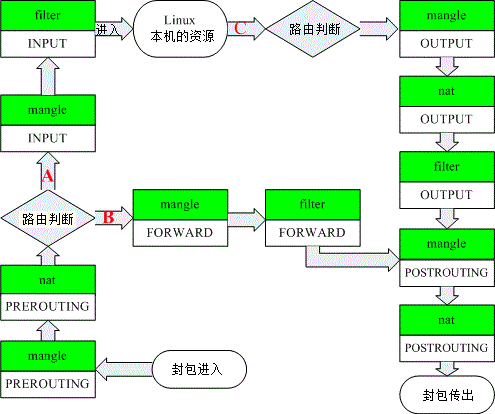
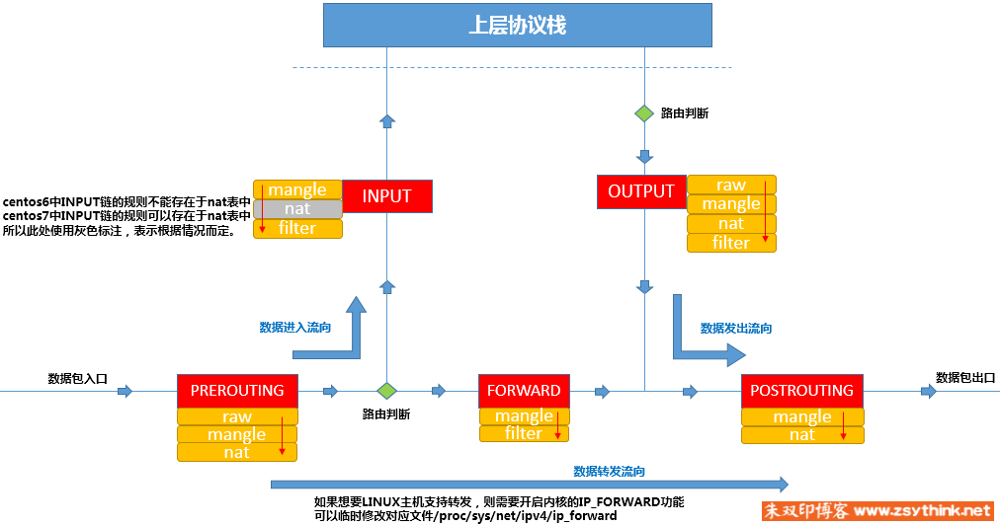

# iptables 介绍

iptables 是一个配置 Linux 内核[防火墙](https://wiki.archlinux.org/index.php/Firewall)的命令行工具，是 [netfilter](https://en.wikipedia.org/wiki/Netfilter) 项目的一部分。术语 iptables 也经常代指该内核级防火墙。

iptables 可以检测、修改、转发、重定向和丢弃 IPv4 数据包。过滤 IPv4 数据包的代码已经内置于内核中，并且按照不同的目的被组织成**表**的集合。**表**由一组预先定义的**链**组成，**链**包含遍历顺序规则。每一条规则包含一个谓词的潜在匹配和相应的动作（称为**目标**），如果谓词为真，该动作会被执行。也就是说条件匹配。iptables 是用户工具，允许用户使用**链**和**规则**。

[TOC]

## 表

### filter 表

包过滤功能。只能使用在：INPUT（处理来自外部的数据），FORWARD（将数据转发到本机的其他网卡设备上），OUTPUT（处理向外发送的数据）。

### nat 表

网络地址转换功能。只能使用在：PREROUTING（转换数据包中的目标 IP 地址,通常用于 DNAT），OUTPUT（处理本机产生的数据包），POSTROUTING（转换数据包中的源 IP 地址,通常用于 SNAT）。

### managle 表

数据包修改（QOS），用于实现服务质量。5 个链都可使用：PREROUTING，INPUT，FORWARD，OUTPUT，POSTROUTING。

### raw 表

配置数据包，如：网址过滤。作用于：PREROUTING，OUTPUT。

### security 表

 [强制访问控制](https://wiki.archlinux.org/index.php/Security#Mandatory_access_control) 网络规则 。（例如： SELinux -- 详细信息参考 [该文章](http://lwn.net/Articles/267140/)）。

### 表优先级

raw > managle > nat > filter。

## 链

### PREROUTING

数据包进入路由表之前。

### INPUT

通过路由表后，目的地为本机。

### FORWARDING

通过路由表后, 目的地不为本机。

### OUTPUT

由本机产生, 向外转发。

### POSTROUTIONG

发送到网卡接口之前。

### 图示

## 动作

- **ACCEPT** ：接收数据包。
- **DROP** ：丢弃数据包，不回应。
- **REJECT**：拒绝数据包，会给发送端回应。
- **REDIRECT** ：重定向、映射、透明代理。
- **SNAT** ：源地址转换。
- **DNAT** ：目标地址转换。
- **MASQUERADE** ：IP伪装（NAT）。
- **LOG** ：只记录日志，然后将数据包传递给下一条规则。

> 1. [iptables详解](<http://www.zsythink.net/archives/1199>)
> 2. [iptables用例](<https://wangchujiang.com/linux-command/c/iptables.html>)
> 3. [Linux防火墙与iptables介绍(以及4表5链概念)](<http://www.mikewootc.com/wiki/linux/usage/linux_firewall_iptables_intro.html>)
> 4. [iptables详细教程：基础、架构、清空规则、追加规则、应用实例](https://lesca.me/archives/iptables-tutorial-structures-configuratios-examples.html)
> 5. [Iptables (简体中文)](https://wiki.archlinux.org/index.php/Iptables_(简体中文))
